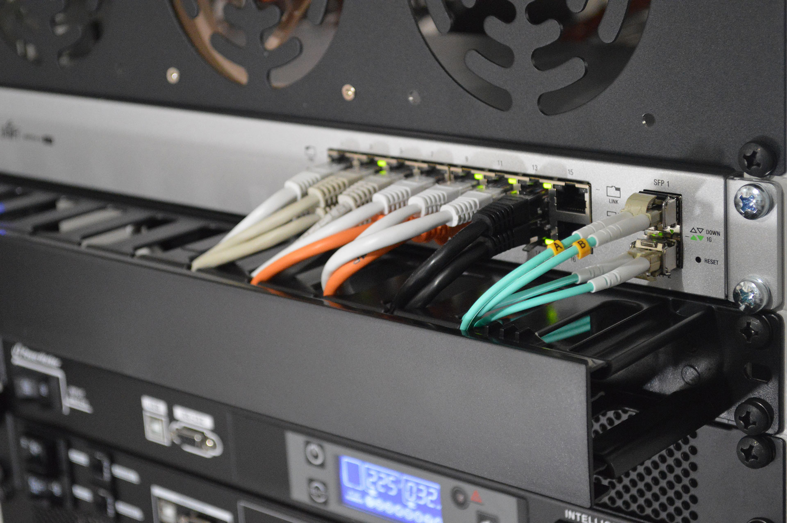

# **BIENVENUE SUR PERFECT NAS SERVER**

## **:material-chat-question: Pourquoi ce site ?**

Cela fait longtemps que je désire m'équiper d'un **NAS**. Après avoir longtemps tergiversé sur la question de m'équiper d'un NAS du commerce (Synology, QNAP, etc) et sur quel modèle choisir, j'ai opté pour un **Homelab** à assembler, installer et configurer soi-même. 

Le fameux **Do It Yourself** de A à Z ! 

Étant passionné d'informatique, je souhaitais créer mom propre laboratoire domestique pour tester de nouveaux logiciels, serveurs et configurations de réseau. J'ai donc dans un premier temps recyclé mon vieux **Rasperry PI 3**. Je me suis vite aperçu qu'avec la facilité de déploiement de stacks Docker (oui, j'utilise cete techno merveilleuse !) que ce dernier devenait bien trop vite juste en terme de ressources.

Je me suis orienté sur l'acquisition d'**un mini-PC [Intel® NUC NUC7i3BNH](https://www.intel.fr/content/www/fr/fr/products/sku/95066/intel-nuc-kit-nuc7i3bnh/specifications.html)** d'occasion que j'ai gonflé, après quelques mois d'utilisation, avec 32GO de RAM (il n'y en avait que 8GO à l'origine).

## **:material-asterisk: Pour quel usage, me direz-vous ?**

C'était surtout pour m'amuser avec la domotique et avec **[Home Assistant](https://www.home-assistant.io/)** mais on se rend assez vite compte qu'il est tellement facile de mettre en oeuvre des services autohébergés via **[Proxmox](https://www.proxmox.com/en/)** ou encore **[Docker](https://www.docker.com/)** que l'usage premier est rapidement détourné et qu'on veut en faire toujours plus.

!!! note
    Si vous souhaitez créer un serveur NAS et vous en servir pour faire tourner d'autres services, vous êtes au bon endroit !

Ce site documente les nombreux aspects de la création d'un serveur NAS ***Network Attached Storage*** à l'aide de logiciels libres et open source. Ce serveur me servira d'**Homelab**.

## **:material-checkbox-marked: Quelques formalités**

L'acronyme NAS, ***pour Network Attached Storage***, désigne un périphérique de stockage utilisé pour le stockage et le partage de fichiers via un réseau (Ethernet, la plupart du temps). Il s'agit d'un serveur de fichiers capable de fonctionner de façon autonome. On le résume parfois à un disque dur relié à un réseau (privé, professionnel, etc.). Il peut être traduit en français par serveur de stockage en réseau, ou stockage raccordé en réseau. Documents, images ou vidéos peuvent être servis depuis un NAS sur les terminaux connectés à son réseau. Des NAS peuvent également être utilisés comme un serveur web.

Souvent comparé aux services de stockage similaires comme Dropbox, Drive, etc, le NAS présente l'avantage de privatiser le réseau utilisé pour le stockage des fichiers. Il autorise un volume de stockage très important et un partage sur plusieurs appareil.

<figure markdown>
  {: width=660 }
  <figcaption><i>Photo de Thomas Jensen sur unsplash.com</i></figcaption>
</figure>

## **:material-lightbulb-on: Prérequis**

De nombreux aspects de ce tutoriel sont basés sur mon expérience et celle d'autres amateurs/professionnels qui ont déjà tenté de constituer ce genre de serveur. Ce site est à destination d'un public averti.

Il est nécessaire de possèder quelques connaissances basiques :

 - L'environnement Linux et son administration,
 - Virtualisation : proxmox, etc,
 - Et pleins d'autres aspects qui découlent de l'administration d'un NAS et/ou d'une machine sous Linux.

## **:fontawesome-solid-feather-pointed: À propos de l'auteur**

{: align=right width=180 }
Cette documentation est écrite et maintenue par [Fabien ALLAMANCHE](https://www.linkedin.com/in/fabien-allamanche/) (alias [@allfab](https://mapstodon.space/@allfab)). 
