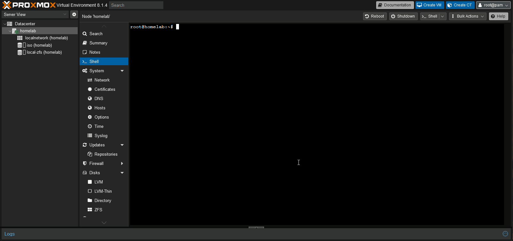

# **mergerFS**

Mergerfs est l'outil magique de notre NAS ! Voici la procédure d'installation.

L'installation dans Ubuntu ou Debian peut être effectuée à l'aide d'`apt` mais la version dans les dépôts est généralement toujours un peu à la traîne. 

Pour installer `mergerFS`, on va préférer utiliser le fichier *.deb que l'on peut télécharger sur le dépôt [https://github.com/trapexit/mergerfs/releases](https://github.com/trapexit/mergerfs/releases)

## **Installation sous debian Bookworm (12)**

``` shell
root@homelab:~# wget https://github.com/trapexit/mergerfs/releases/download/2.40.2/mergerfs_2.40.2.debian-bookworm_amd64.deb
root@homelab:~# dpkg -i mergerfs_2.40.2.debian-bookworm_amd64.deb
```

On vérifie que l'installation est effective :

``` shell
root@homelab:~# mergerfs --version
mergerfs v2.40.2

https://github.com/trapexit/mergerfs
https://github.com/trapexit/support

ISC License (ISC)

Copyright 2023, Antonio SJ Musumeci <trapexit@spawn.link>

Permission to use, copy, modify, and/or distribute this software for
any purpose with or without fee is hereby granted, provided that the
above copyright notice and this permission notice appear in all
copies.

THE SOFTWARE IS PROVIDED "AS IS" AND THE AUTHOR DISCLAIMS ALL
WARRANTIES WITH REGARD TO THIS SOFTWARE INCLUDING ALL IMPLIED
WARRANTIES OF MERCHANTABILITY AND FITNESS. IN NO EVENT SHALL THE
AUTHOR BE LIABLE FOR ANY SPECIAL, DIRECT, INDIRECT, OR CONSEQUENTIAL
DAMAGES OR ANY DAMAGES WHATSOEVER RESULTING FROM LOSS OF USE, DATA OR
PROFITS, WHETHER IN AN ACTION OF CONTRACT, NEGLIGENCE OR OTHER
TORTIOUS ACTION, ARISING OUT OF OR IN CONNECTION WITH THE USE OR
PERFORMANCE OF THIS SOFTWARE.
```


## **Configuration des disques dur**

La section suivante détaille les étapes pour identifier, monter et partitionner les disques durs de votre système.

### Monter ses disques manuellement

Afin d'utiliser les disques durs présents sur notre NAS, notre système d'exploitation doit les monter. Le **montage** signifie que nous fournissons au système d'exploitation des instructions sur la façon de lire ou d'écrire des données sur un lecteur spécifique. Afin d'être le plus compatible avec `mergerFS`, il est conseillé de configurer les disques à utiliser avec notre NAS avec une unique partition et à la formater avec un seul système de fichiers qui s'étend sur l'intégralité du disque, souvent `ext4` ou `xfs`, puis à les monter sur le sytème.

Il y a de multiples systèmes de fichiers disponibles sous Linux et il n’y a pas de bon ou de mauvais choix. Cependant, on recommande l'`ext4` ou `xfs` pour rester dans des choses simples.

!!! info
    N'oubliez pas qu'avec mergerFS, on peut mélanger et faire correspondre en toute sécurité les systèmes de fichiers et les tailles de lecteur, **ce qui fait partie de sa véritable magie**. 
    
    Cela signifie que vous n'avez pas à trop vous soucier de choisir exactement le bon système de fichiers dès le départ, **car vous n'êtes pas enfermé**.


### Identification des disques durs

Répertoriez tous les lecteurs d'un système avec :

``` shell
root@homelab:~# ls -l /dev/disk/by-id

lrwxrwxrwx 1 root root  9 Mar 26 14:52 ata-VBOX_HARDDISK_VB2ff4aa6e-3b5752ba -> ../../sdd
lrwxrwxrwx 1 root root  9 Mar 26 14:52 ata-VBOX_HARDDISK_VB41f1fa4d-a2c11c14 -> ../../sdf
lrwxrwxrwx 1 root root  9 Mar 26 14:52 ata-VBOX_HARDDISK_VB4d776a0a-b24c3eb0 -> ../../sda
lrwxrwxrwx 1 root root 10 Mar 26 14:52 ata-VBOX_HARDDISK_VB4d776a0a-b24c3eb0-part1 -> ../../sda1
lrwxrwxrwx 1 root root 10 Mar 26 14:52 ata-VBOX_HARDDISK_VB4d776a0a-b24c3eb0-part2 -> ../../sda2
lrwxrwxrwx 1 root root 10 Mar 26 14:52 ata-VBOX_HARDDISK_VB4d776a0a-b24c3eb0-part3 -> ../../sda3
lrwxrwxrwx 1 root root  9 Mar 26 14:52 ata-VBOX_HARDDISK_VB4fd111ed-7ccb2978 -> ../../sdb
lrwxrwxrwx 1 root root 10 Mar 26 14:52 ata-VBOX_HARDDISK_VB4fd111ed-7ccb2978-part1 -> ../../sdb1
lrwxrwxrwx 1 root root 10 Mar 26 14:52 ata-VBOX_HARDDISK_VB4fd111ed-7ccb2978-part2 -> ../../sdb2
lrwxrwxrwx 1 root root 10 Mar 26 14:52 ata-VBOX_HARDDISK_VB4fd111ed-7ccb2978-part3 -> ../../sdb3
lrwxrwxrwx 1 root root  9 Mar 26 14:52 ata-VBOX_HARDDISK_VBb598f427-91b62771 -> ../../sdc
lrwxrwxrwx 1 root root  9 Mar 26 14:52 ata-VBOX_HARDDISK_VBbc16d229-98501233 -> ../../sde
```
Ou avec :
``` shell
root@homelab:~# ls -l /dev/disk/by-uuid

total 0
lrwxrwxrwx 1 root root  9 Mar 26 14:52 01418e86-d606-4d40-acf4-79af5045172c -> ../../sdc
lrwxrwxrwx 1 root root 10 Mar 26 14:52 4F35-0F4B -> ../../sda2
lrwxrwxrwx 1 root root 10 Mar 26 14:52 4F3A-0665 -> ../../sdb2
lrwxrwxrwx 1 root root 10 Mar 26 14:52 9126907211302610478 -> ../../sda3
```

Ou encore :
``` shell
root@homelab:~# fdisk -l
Disk /dev/sda: 1 TiB, 1099511627776 bytes, 2147483648 sectors
Disk model: VBOX HARDDISK   
Units: sectors of 1 * 512 = 512 bytes
Sector size (logical/physical): 512 bytes / 512 bytes
I/O size (minimum/optimal): 512 bytes / 512 bytes
Disklabel type: gpt
Disk identifier: 30CEC8C0-5E64-4538-BCB6-14419B0A845D

Device       Start        End    Sectors  Size Type
/dev/sda1       34       2047       2014 1007K BIOS boot
/dev/sda2     2048    2099199    2097152    1G EFI System
/dev/sda3  2099200 2147483614 2145384415 1023G Solaris /usr & Apple ZFS

root@homelab:~# fdisk -l
Disk /dev/sda: 1 TiB, 1099511627776 bytes, 2147483648 sectors
Disk model: VBOX HARDDISK   
Units: sectors of 1 * 512 = 512 bytes
Sector size (logical/physical): 512 bytes / 512 bytes
I/O size (minimum/optimal): 512 bytes / 512 bytes
Disklabel type: gpt
Disk identifier: 30CEC8C0-5E64-4538-BCB6-14419B0A845D

Device       Start        End    Sectors  Size Type
/dev/sda1       34       2047       2014 1007K BIOS boot
/dev/sda2     2048    2099199    2097152    1G EFI System
/dev/sda3  2099200 2147483614 2145384415 1023G Solaris /usr & Apple ZFS


Disk /dev/sdb: 1 TiB, 1099511627776 bytes, 2147483648 sectors
Disk model: VBOX HARDDISK   
Units: sectors of 1 * 512 = 512 bytes
Sector size (logical/physical): 512 bytes / 512 bytes
I/O size (minimum/optimal): 512 bytes / 512 bytes
Disklabel type: gpt
Disk identifier: 1938A24D-F234-4DAE-958D-964B26179408

Device       Start        End    Sectors  Size Type
/dev/sdb1       34       2047       2014 1007K BIOS boot
/dev/sdb2     2048    2099199    2097152    1G EFI System
/dev/sdb3  2099200 2147483614 2145384415 1023G Solaris /usr & Apple ZFS


Disk /dev/sdc: 128 GiB, 137438953472 bytes, 268435456 sectors
Disk model: VBOX HARDDISK   
Units: sectors of 1 * 512 = 512 bytes
Sector size (logical/physical): 512 bytes / 512 bytes
I/O size (minimum/optimal): 512 bytes / 512 bytes


Disk /dev/sdd: 2 TiB, 2199022206976 bytes, 4294965248 sectors
Disk model: VBOX HARDDISK   
Units: sectors of 1 * 512 = 512 bytes
Sector size (logical/physical): 512 bytes / 512 bytes
I/O size (minimum/optimal): 512 bytes / 512 bytes


Disk /dev/sde: 2 TiB, 2199022206976 bytes, 4294965248 sectors
Disk model: VBOX HARDDISK   
Units: sectors of 1 * 512 = 512 bytes
Sector size (logical/physical): 512 bytes / 512 bytes
I/O size (minimum/optimal): 512 bytes / 512 bytes


Disk /dev/sdf: 2 TiB, 2199022206976 bytes, 4294965248 sectors
Disk model: VBOX HARDDISK   
Units: sectors of 1 * 512 = 512 bytes
Sector size (logical/physical): 512 bytes / 512 bytes
I/O size (minimum/optimal): 512 bytes / 512 bytes
```

Cette liste va nous permettre d'identifier les disques et de mapper les lecteurs éphémères tels que `/dev/sda` et `ata-HGST_HDN728080ALE604_R6GPPDTY` qui est l'ID. du disque dur. 

Inversement, pour l'identification du lecteur éphémère, on peut le faire en utilisant cette commande :
``` shell
root@homelab:~# ls -l /dev/disk/by-id/ata-HGST_HDN728080ALE604_R6GPPDTY
lrwxrwxrwx 1 root root 9 Sep  9 23:08 /dev/disk/by-id/ata-HGST_HDN728080ALE604_R6GPPDTY -> ../../sda
```

Par conséquent, nous pouvons vérifier que `/dev/sda` est mappé sur ce lecteur physique.

!!! warning
    N'utilisez jamais `/dev/sdX` comme solution à long terme pour l'identification du lecteur, car ces identifiants peuvent changer et changent sans avertissement en raison d'autres modifications matérielles, mises à niveau du noyau, etc...
    
    L'identifiant `/dev/disk/by-id` est lié à cet élément spécifique du matériel, par modèle de lecteur et numéro de série et **ne changera donc jamais**.


### Partitionnement

Avant de créer une partition sur un disque dur fraichement sorti de son emballage, assurez-vous de l'avoir « gravé » comme explicité ici : [Rituel de gravure de disque dur neuf]().

!!! warning 
    **ATTENTION** - Nous sommes sur le point d'effectuer des étapes destructrices sur la table de partition du lecteur. S'il y a des données existantes sur ce disque, elles seront effacées. **Assurez-vous d'être prudent et réfléchi auquel cas vous allez perdre vos données !**

Les étapes suivantes nécessiteront un accès root. En utilisant notre exemple de lecteur de la section précédente, nous utiliserons l'utilitaire `cfdisk` et ou `sgdisk` pour créer une nouvelle partition et un nouveau système de fichiers.


!!! abstract "Note" 
    Faisons l'exercice pour le disque qui nous servira de disque de parité pour Snapraid. Le processus sera le même pôur les disques de données.

Si le disque n'est pas vide et que vous souhaitez repartir sur un disque nu.

Suppression des tables de partition (le volume apparaît comme sans table de partition) :
``` shell
root@homelab:~# sgdisk /dev/sdd -Z
```
Création d'une table de partition gpt et vérification du disque :
<figure markdown="span">
  { width="600" }
  <figcaption>Partionnement d'un disque</figcaption>
</figure>

### Création du système de fichiers
Créez un système de fichiers ext4 (remplacez X par votre lettre de lecteur) avec une étiquette :
``` shell
root@homelab:~# mkfs.ext4 -L PARITY /dev/sdd1
Disk /dev/sdd: 2 TiB, 2199022206976 bytes, 4294965248 sectors
Disk model: VBOX HARDDISK   
Units: sectors of 1 * 512 = 512 bytes
Sector size (logical/physical): 512 bytes / 512 bytes
I/O size (minimum/optimal): 512 bytes / 512 bytes
Disklabel type: gpt
Disk identifier: 80560CA3-03D0-134F-9107-6B1DE289A724

Device     Start        End    Sectors Size Type
/dev/sdd1   2048 4294963199 4294961152   2T Linux filesystem
root@homelab:~# mkfs.ext4 /dev/sdd1
mke2fs 1.47.0 (5-Feb-2023)
Creating filesystem with 536870144 4k blocks and 134217728 inodes
Filesystem UUID: 810c4257-aa5c-447f-b839-545e37ad7bcf
Superblock backups stored on blocks: 
        32768, 98304, 163840, 229376, 294912, 819200, 884736, 1605632, 2654208, 
        4096000, 7962624, 11239424, 20480000, 23887872, 71663616, 78675968, 
        102400000, 214990848, 512000000

Allocating group tables: done                            
Writing inode tables: done                            
Creating journal (262144 blocks): done
Writing superblocks and filesystem accounting information: done
```
Votre nouveau disque est maintenant formaté et prêt à stocker des données.


### Points de montage

Les points de montage sont l'endroit où le système d'exploitation monte une partition de disque spécifique. Par exemple, vous pouvez avoir plusieurs partitions sur le même disque montées à différents endroits pour des raisons de redondance ou de performances. Pour nos besoins ici, nous garderons les choses simples en montant chaque partition de disque de données une par une.

En supposant que le test précédent s'est bien passé, il est temps de proposer un schéma de dénomination des points de montage. Je vous recommande /mnt/diskN car il simplifie l'entrée fstab pour les fusions grâce à la prise en charge des caractères génériques Linux.

!!! abstract "Note"
    N'oubliez pas de répéter le partitionnement des disques de données au préablable via `cfdisk` comme vu précédemment sur le disque de parité /dev/sdd.

!!! warning 
    **ATTENTION** - Nous sommes sur le point d'effectuer des étapes destructrices sur la table de partition du lecteur. S'il y a des données existantes sur ce disque, elles seront effacées. **Assurez-vous d'être prudent et réfléchi auquel cas vous allez perdre vos données !**

Par exemple:
``` shell
root@homelab:~# mkdir /mnt/parity
root@homelab:~# mount /dev/sdd1 /mnt/parity
# ON PEUT AUSSI MONTER LA PARTITION VIA SON ID
# ls -l /dev/disk/by-id/
root@homelab:~# mount /dev/disk/by-id/ata-VBOX_HARDDISK_VB2ff4aa6e-3b5752ba-part1 /mnt/parity
# ON PEUT ENCORE MONTER LA PARTITION VIA SON UUID
# ls -l /dev/disk/by-uuid/
root@homelab:~# mount /dev/disk/by-uuid/255626b6-4990-4a78-85f2-00a84393719c /mnt/parity

root@homelab:~# mkfs.ext4 -L DATA01 /dev/sde1
root@homelab:~# mkfs.ext4 -L DATA02 /dev/sdf1
root@homelab:~# mkdir /mnt/data0{1,2}
root@homelab:~# mount /dev/sde1 /mnt/data01
root@homelab:~# mount /dev/sdf1 /mnt/data02

root@homelab:~# mkdir /mnt/storage
```

#### Entrées FSTAB

Ensuite, nous devons créer une entrée dans `/etc/fstab`. Ce fichier indique à votre système d'exploitation comment, où et quels disques monter.  Cela semble un peu complexe mais une entrée fstab est en fait assez simple et se décompose en :

- `device` > `mountpoint` > `filesystem` > `options` > `dump` >`fsck` - documentation fstab.

##### Via l'ID des disques durs

``` shell
root@homelab:~# vi /etc/fstab

# MERGERFS
/dev/disk/by-id/ata-VBOX_HARDDISK_VB2ff4aa6e-3b5752ba-part1 /mnt/parity ext4 defaults 0 0
/dev/disk/by-id/ata-VBOX_HARDDISK_VB41f1fa4d-a2c11c14-part1 /mnt/data01 ext4 defaults 0 0
/dev/disk/by-id/ata-VBOX_HARDDISK_VBbc16d229-98501233-part1 /mnt/data02 ext4 defaults 0 0

# Notez que mergerfs ne monte pas le lecteur de parité, il monte uniquement /mnt/data0*.
# Mergerfs n'a rien à voir avec la parité, pour cela, nous utilisons SnapRAID.
/mnt/data0* /mnt/storage fuse.mergerfs defaults,nonempty,cache.files=off,category.create=epmfs,moveonenospc=true,dropcacheonclose=true,minfreespace=5G,fsname=mergerfs 0 0

```

##### Via l'UUID des disques durs

``` shell
root@homelab:~# vi /etc/fstab

# MERGERFS
UUID="255626b6-4990-4a78-85f2-00a84393719c" /mnt/parity ext4 defaults 0 0
UUID="0ff04694-f4ca-4442-8d58-7ec2b23ad3a8" /mnt/data01 ext4 defaults 0 0
UUID="32b0ee6b-6cc4-44ce-8ed1-866138365a50" /mnt/data02 ext4 defaults 0 0

# Notez que mergerfs ne monte pas le lecteur de parité, il monte uniquement /mnt/data0*.
# Mergerfs n'a rien à voir avec la parité, pour cela, nous utilisons SnapRAID.
/mnt/data0* /mnt/storage fuse.mergerfs defaults,nonempty,cache.files=off,category.create=epmfs,moveonenospc=true,dropcacheonclose=true,minfreespace=5G,fsname=mergerfs 0 0
```

Visualisation des points de montage :
``` shell
root@homelab:~# df -h
Filesystem        Size  Used Avail Use% Mounted on
udev              3.9G     0  3.9G   0% /dev
tmpfs             794M  836K  793M   1% /run
rpool/ROOT/pve-1  985G  1.8G  983G   1% /
tmpfs             3.9G   43M  3.9G   2% /dev/shm
tmpfs             5.0M     0  5.0M   0% /run/lock
mergerfs          4.0T   56K  3.8T   1% /mnt/storage
/dev/sdc          125G   40K  119G   1% /mnt/iso
/dev/sdf1         2.0T   28K  1.9T   1% /mnt/data01
/dev/sdd1         2.0T   28K  1.9T   1% /mnt/parity
/dev/sde1         2.0T   28K  1.9T   1% /mnt/data02
rpool/pgdata      983G  128K  983G   1% /var/lib/postgresql
rpool/var-lib-vz  983G  128K  983G   1% /var/lib/vz
rpool             983G  128K  983G   1% /rpool
rpool/ROOT        983G  128K  983G   1% /rpool/ROOT
rpool/data        983G  128K  983G   1% /rpool/data
/dev/fuse         128M   16K  128M   1% /etc/pve
tmpfs             794M     0  794M   0% /run/user/0
```

##### Options de montage de mergerfs

La documentation : [https://github.com/trapexit/mergerfs?tab=readme-ov-file#options](https://github.com/trapexit/mergerfs?tab=readme-ov-file#options) et le rappel de [la politique de stockage utilisée](/tech-stack/processus/#mergerfs)

- **minfreespace = SIZE** :
	- valeur d'espace minimale utilisée pour les stratégies de création. Peut être remplacé par une option spécifique à la branche. Comprend « K », « M » et « G » comme représentant respectivement le kilo-octet, le mégaoctet et le gigaoctet. (par défaut : 4G)
- **moveonenospc = BOOL|POLICY** : 
	- Lorsqu'elle est activée si une écriture échoue avec ENOSPC (aucun espace disponible sur l'appareil) ou EDQUOT (quota de disque dépassé), la stratégie sélectionnée s'exécutera pour trouver un nouvel emplacement pour le fichier. Une tentative de déplacement du fichier vers cette branche se produira (en gardant toutes les métadonnées possibles) et en cas de succès, l'original sera dissocié et l'écriture sera réessayée. (par défaut : faux, vrai = mfs)
- **dropcacheonclose = BOOL** :
    - Lorsqu'il est demandé de fermer un fichier, appelez d'abord posix_fadvise pour indiquer au noyau que nous n'avons plus besoin des données et qu'il peut supprimer son cache. Recommandé lorsque cache.files=partial|full|auto-full|per-process pour limiter la double mise en cache. (par défaut : faux)
- **category.action = POLICY** :
    - Définit la politique de toutes les fonctions FUSE dans la catégorie d'action. (par défaut : epall)
- **category.create = POLICY** :
    - Définit la politique de toutes les fonctions FUSE dans la catégorie de création. (par défaut : epmfs)
- **category.search = POLICY** :
    - Définit la politique de toutes les fonctions FUSE dans la catégorie de recherche. (par défaut : ff)
- **cache.files = libfuse|off|partial|full|auto-full|per-process** :
    - Mode de mise en cache des pages de fichiers (par défaut : libfuse)
- **fsname = STR** :
    - Définit le nom du système de fichiers tel qu'il apparaît dans mount, df, etc. La valeur par défaut est une liste des chemins sources concaténés avec le préfixe commun le plus long supprimé.

Afin de recharger les nouvelles entrées `fstab` que nous avons créées et de les vérifier avant de redémarrer, montons-les
``` shell
root@homelab:~# mount -a
```

Vérifiez ensuite les points de montage avec `df -h` ou enocre `duf` :
``` shell
root@homelab:~# 
```

### Exemple d'arborescence des fichiers

``` shell
root@homelab:/# tree /mnt/data01

/mnt/data01/
├── lost+found
└── media
    ├── musics
    ├── photos
    └── videos

root@homelab:/# tree /mnt/data02
/mnt/data02
├── backups
│   └── proxmox
├── docker
│   └── appdata
└── lost+found

root@homelab:/# tree /mnt/storage
/mnt/storage/
├── backups
│   └── proxmox
├── docker
│   └── appdata
├── lost+found
└── media
    ├── musics
    ├── photos
    └── videos
```
