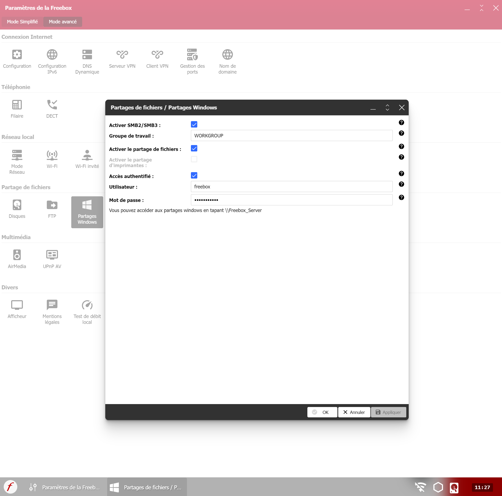

# **NFS**

Coming soon

# **Configurer un partage Samba**

## Installation de Samba
``` bash
sudo apt install samba smbclient cifs-utils
```

### Définir les paramètres globaux de Samba

Editer le fichier **_/etc/samba/smb.conf_** :

```
[public]
	comment = Public Folder 
	path = /public 
	writable = yes 
	guest ok = yes 
	guest only = yes 
	force create mode = 775 
	orce directory mode = 775 

[private]
	comment = Private Folder
	path = /private
	writable = yes
	guest ok = no
	valid users = @smbshare
	force create mode = 770
	force directory mode = 770
	inherit permissions = yes

[NUC-Home]
   comment = NUC - Home
   path = /home/docker
   guest ok = no
   read only = no
   browseable = yes
   writeable = yes
   valid users = docker
```

### Créer un utilisateur et un groupe Samba

Nous avons besoin du groupe d'utilisateurs de partage Samba pour accéder au partage privé comme spécifié dans la configuration ci-dessus. Nous allons donc créer le groupe comme ci-dessous.

``` bash
sudo groupadd smbshare
```

Ajoutez les autorisations nécessaires pour le partage privé.

``` bash
sudo chgrp -R smbshare /private/
sudo chgrp -R smbshare /public
```

Définissez les bonnes autorisations de répertoire.
``` bash
sudo chmod 2770 /private/
sudo chmod 2775 /public
```

Dans la commande ci-dessus, la valeur 2 au début correspond au stickybit. Cela permet aux fichiers nouvellement créés d'hériter du groupe parent.

Ensuite, créez un utilisateur local sans connexion pour accéder au partage privé :
``` bash
sudo useradd -M -s /sbin/nologin sambauser
```

Ajoutez l'utilisateur au groupe de partage Samba créé ci-dessus :
``` bash
sudo usermod -aG smbshare sambauser
```

Créez maintenant un mot de passe SMB pour l'utilisateur :
``` bash
sudo smbpasswd -a sambauser```

Activez le compte créé :
``` bash
sudo smbpasswd -e sambauser
```

### Vérifiez la configuration de Samba

Une fois les modifications apportées au fichier de configuration, il est recommandé de le tester à l'aide de la commande ci-dessous :
``` bash
sudo testparm
```

Si vous n'avez pas de message d'erreur, on redémarre le service :
``` bash
sudo systemctl restart nmbd
```

### Accéder aux partages depuis un client

Ce guide montre comment accéder aux fichiers partagés à l'aide des systèmes Windows et Linux. Tout d’abord, essayez d’accéder au partage depuis votre ordinateur local.

``` bash
smbclient '\\localhost\private' -U sambauser
```

# Configurer le partage de fichier sur Freebox OS

- Prérequis :
	- Sur la console d'administration du routeur Freebox : http://mafreebox.freebox.fr/
		- Dans la rubrique **Paramètres de la Freebox**, puis **Partage de fichiers** cliquez sur **Partages Windows** :
        <figure markdown="span">
    { width="600" }
</figure>

Il faudra renseigner le nom d’utilisateur et mot de passe pour accéder au partage et son activation

- Sur le client Debian :

``` bash
sudo apt-get install cifs-utils

sudo mkdir /media/freebox/

sudo touch /home/$USER/.smbcredentials
```

Edition du fichier **.smbcredentials*** :
``` bash
sudo nano /home/$USER/.smbcredentials
```

Dans le fichier, ajoutez les lignes suivantes (remplacez les XXXX par votre login et mot de passe) :
``` bash
username=freebox
password=mypassword
domain=WORKGROUP
```

Donnez les droits adéquats au fichier **.smbcredentials** :
``` bash
sudo chown -R $USER:root /home/$USER/.smbcredentials
sudo chmod -R 775 /home/$USER/.smbcredentials
```

Montage à la volée :
``` bash
sudo mount -t cifs //mafreebox.freebox.fr/Disque\ dur/Vidéos /home/docker/media/videos/freebox -o rw,uid=1000,gid=1000,credentials=/home/docker/.smbcredentials,iocharset=utf8,file_mode=0777,dir_mode=0777
```

Afin d’avoir un comportement semblable à Windows, c’est-à-dire, retrouver le partage dans l’explorateur de fichier et cela, même après un redémarrage, il faut monter le partage dans le fichier fstab afin que celui-ci soit bien remonter après redémarrage de la machine.

Avant toute modifications, nous allons faire une sauvegarde de l’ancienne configuration :
``` bash
sudo cp /etc/fstab /etc/fstab.old
```

À présent, on va ajouter l’accès au partage Freebox dans fstab :
``` bash
# MONTAGE DU PARTAGE FREEBOX
//192.168.0.254/Disque\ dur    /media/partage    cifs    guest,iocharset=utf8,gid=100,uid=1000,_netdev,file_mode=0777,dir_mode=0777,vers=2.0    0    0

//192.168.0.254\Disque\ dur /media/freebox cifs _netdev,rw,users,credentials=/home/$USER/.smbcredentials,iocharset=utf8,uid=1000,sec=ntlmv2,file_mode=0777,dir_mode=0777,vers=2.00    0    0
```
- **uid=1000** indique l'id du user local (éviter les conflits de droits),
- **_netdev** fait attendre le montage que la partie réseau soit démarrée,
- **rw** n'est plus nécessaire (option par défaut),
- **iocharset=utf8** est l'encodage de fichiers.

Avant de redémarrer, il faut tester qu'il n'y a pas d'erreurs (sinon blocage boot) :

``` bash
mount -a
```

Tout démonter :

``` bash
sudo umount -a -t cifs -l
```

***Afin de tester le bon fonctionnement, je vous conseille de redémarrer votre machine et vérifier que vous avez bien accès votre partage Freebox.***