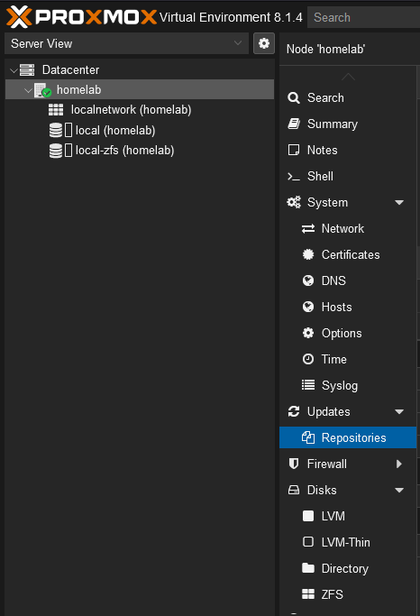
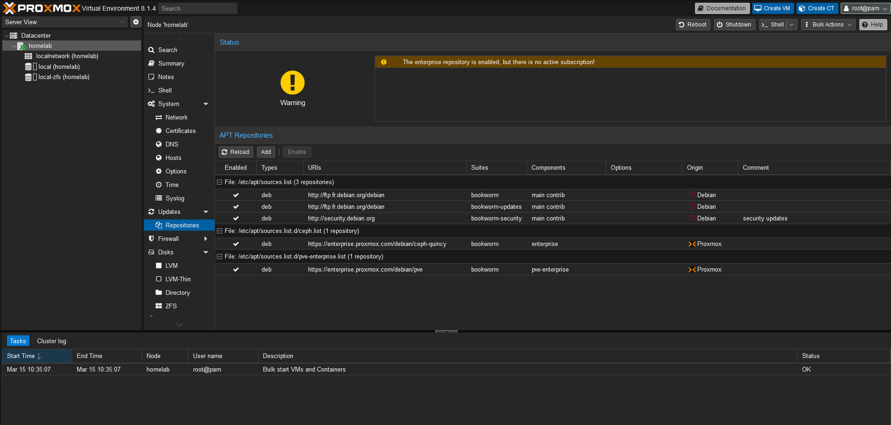
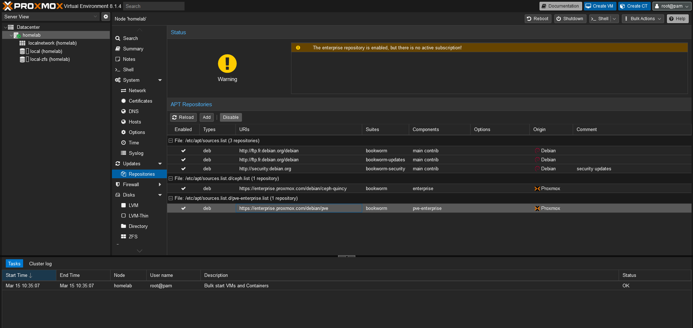
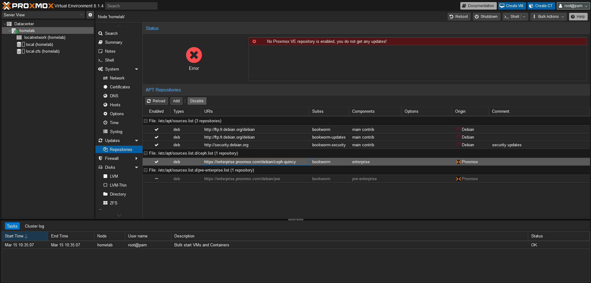
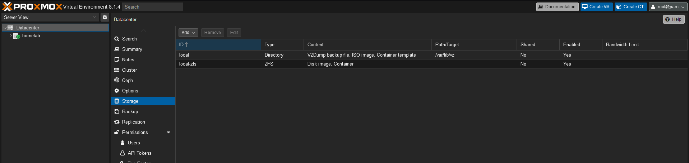
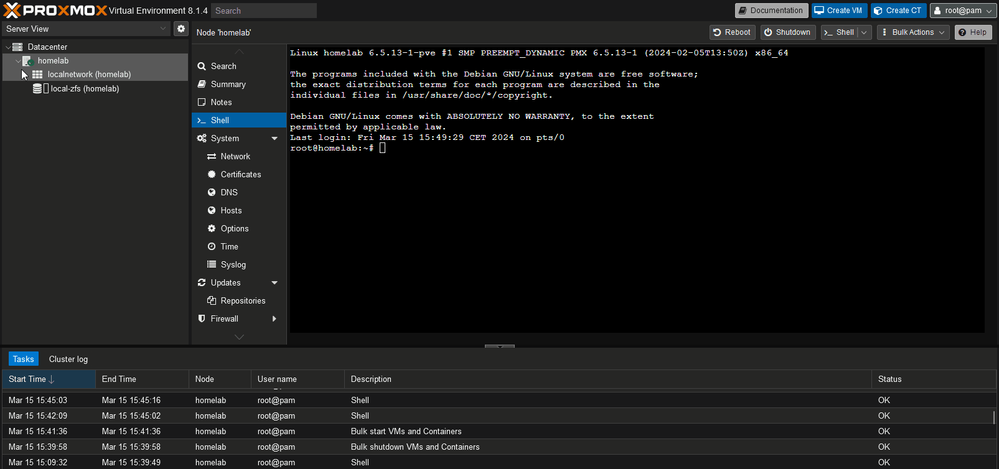

# **:material-note-edit:POST-INSTALLATION - Proxmox - Configuration**

## **:material-source-repository: Désactiver les dépôts pve-enterprise et ceph**

La première chose à faire dans la configuration de Proxmox, est de désactiver le dépôt PVE Entreprise et Ceph si on n'en a pas l'utilité.

On peut le faire de 2 façons différentes :

- Via l'interface graphique
- Ou en ligne de commande

### :material-television-guide: Via l'interface graphique

Se rendre sous ***homelab > Updates > Repositories*** :

<figure markdown="span">
  { width="600" }
  <figcaption>homelab > Updates > Repositories</figcaption>
</figure>

Pour le dépot ***https://entreprise.proxmox.com/debian/pve*** :

<figure markdown="span">
  { width="600" }
  <figcaption>On retrouve cette interface</figcaption>
</figure>

<figure markdown="span">
  { width="600" }  
  { width="600" }
  <figcaption>On sélectionne la ligne <b><i>https://entreprise.proxmox.com/debian/pve</i></b> et on la désactive en cliquant sur le bouton <b><i>Disable</i></b> qui se trouve au-dessus</figcaption>  
</figure>

Pour le dépot ***https://entreprise.proxmox.com/debian/ceph-quincy*** :

On réitère les étapes ci-dessus en prenant le soin de bien sélectionner le dépôt ***https://entreprise.proxmox.com/debian/ceph-quincy***

### :material-console: En ligne de commande

On se connect en SSH sur le serveur Proxmox ou via le Shell sur l'interface graphique. 
On va venir éditer ce fichier et commenter la ligne :
``` shell
$ vi /etc/apt/sources.list.d/pve-enterprise.list

# deb https://enterprise.proxmox.com/debian/pve bookworm pve-enterprise
```
 Pareil pour le dépôt Ceph :
``` shell
$ vi /etc/apt/sources.list.d/ceph.list

# deb https://enterprise.proxmox.com/debian/ceph-quincy bookworm enterprise
```

## **:material-source-repository: Activer le dépôt pve-no-subscription**

<figure markdown="span">
  { width="600" }
  <figcaption>XXXXX</figcaption>
</figure>

## **:material-source-repository: Désactiver le stockage par défaut local**

<figure markdown="span">
  { width="600" }
  <figcaption>Stockage à désactiver</figcaption>
</figure>

### :material-television-guide: Via l'interface graphique

On sélectionne la ligne correspondant au stockage que l'on veut désactiver, on clique sur `Edit` et on décoche `Enable` et on valide.

### :material-console: En ligne de commande

Pour désactiver le stockage `local` sur `/var/lib/vz` :
``` shell
$ pvesm set local --disable 0
```

Pour activer le stockage `local` sur `/var/lib/vz` :
``` shell
$ pvesm set local --disable 0
```

Référence : [https://pve.proxmox.com/wiki/Storage#_using_the_command_line_interface](https://pve.proxmox.com/wiki/Storage#_using_the_command_line_interface)

## Proxmox et LVM

### **De l'utilisation du volume logique `/dev/pve/data`**
`
Le programme d'installation crée un groupe de volumes (VG) appelé **pve** et des volumes logiques (LV) supplémentaires appelés **root, data et swap**. 

Pour contrôler la taille de ces volumes, Proxmox utilise les options suivantes :

`hdsize` : Définit la taille totale du disque dur à utiliser. De cette façon, vous pouvez réserver de l'espace libre sur le disque dur pour un partitionnement ultérieur (par exemple pour un PV et un VG supplémentaires sur le même disque dur pouvant être utilisés pour le stockage LVM).  

`swapsize` : Définit la taille du volume de swap. La valeur par défaut est la taille de la mémoire installée, minimum 4 Go et maximum 8 Go. La valeur résultante ne peut pas être supérieure à hdsize/8. 

Remarque : Si la valeur est 0, aucun volume d'échange ne sera créé. 

`maxroot` : Définit la taille maximale du volume racine, qui stocke le système d'exploitation. La limite maximale de la taille du volume racine est hdsize/4.  

`maxvz` : Définit la taille maximale du volume de données. La taille réelle du volume de données est :  `datasize = hdsize - rootsize - swapsize - minfree`
  
Où la taille des données ne peut pas être supérieure à maxvz.  

!!! abstract "Note" 
    Remarque : En cas de LVM Thin, le pool de données ne sera créé que si la taille des données est supérieure à 4 Go.  
    Remarque : Si la valeur est 0, aucun volume de données ne sera créé et la configuration du stockage sera adaptée en conséquence.

`minfree` :  
Définit la quantité d'espace libre restant dans le groupe de volumes LVM **`pve`**.
Avec plus de 128 Go de stockage disponible, la valeur par défaut est 16 Go, sinon hdsize/8 sera utilisé.  
Remarque : LVM nécessite de l'espace libre dans le VG pour la création d'instantanés (non requis pour les instantanés lvmthin).

!!! abstract "Note"
    Avec cette configuration, on n'a pas totalement la main sur la taille des volumes logiques créés. La suite de cette documentation détaille comment supprimer le volume logique `/dev/pve/data` et de récupérer l'espace disque supplémentaire pour agrandir le volume logique `/dev/pve/root`.
    Noter qur nous utiliserons un disque dur complémentaire afin de recréer un volume logique `/dev/pve/data`.

!!! danger "Avertissement"
    Ces opérations doivent être réalisées sur une installation initiale et avec précaution. À ne pas faire sur une installation de `Proxmox` en production.


### **Suppression du volume logique `data` et extension du volume logique `root` avec l'espace disque libéré**

Désactivation du volume logique `/dev/pve/data` et suppression du volume logique :
```bash
lvchange -an /dev/pve/data
lvremove /dev/pve/data
```

Agrandir le volume logique `/dev/pve/root` avec l'espace disque libéré par la suppression du volume logique `/dev/pve/data`
```bash
lvextend -l +100%FREE /dev/pve/root
```

Il faut maintenant penser à agrandir le système de fichier du volume logique `/dev/pve/root`. 
Vérification du système de fichier utilisé sur `/dev/pve/root` :
```bash
lsblk -o NAME,TYPE,MOUNTPOINT,FSTYPE,FSSIZE,SIZE,FSAVAIL

NAME         TYPE MOUNTPOINT FSTYPE      FSSIZE  SIZE FSAVAIL
sda          disk                                 60G 
├─sda1       part                               1007K 
├─sda2       part            vfat                512M 
└─sda3       part            LVM2_member        59.5G 
  ├─pve-swap lvm  [SWAP]     swap                  8G 
  └─pve-root lvm  /          ext4         24.3G 51.5G   19.4G
sdb          disk                                128G 
```

Le système de fichier `/dev/pve/root` est en `ext4`. On réalise l'agrandissement à chaud sans démonter le volume :
```bash
resize2fs /dev/pve/root
```

```bash
lsblk -o NAME,TYPE,MOUNTPOINT,FSTYPE,FSSIZE,SIZE,FSAVAIL

NAME         TYPE MOUNTPOINT FSTYPE      FSSIZE  SIZE FSAVAIL
sda          disk                                 60G 
├─sda1       part                               1007K 
├─sda2       part            vfat                512M 
└─sda3       part            LVM2_member        59.5G 
  ├─pve-swap lvm  [SWAP]     swap                  8G 
  └─pve-root lvm  /          ext4         50.5G 51.5G   44.6G
sdb          disk                                128G 
```


### **Création du volume logique `/dev/pve/data` sur un disque dur prévu à cet effet `/dev/sdb`**

Etat des lieux `LVM`:
```bash
pvdisplay

--- Physical volume ---
  PV Name               /dev/sda3
  VG Name               pve
  PV Size               <63.50 GiB / not usable 2.98 MiB
  Allocatable           yes (but full)
  PE Size               4.00 MiB
  Total PE              16255
  Free PE               0
  Allocated PE          16255
  PV UUID               QCTN2f-GNZR-TWsG-q8IR-3Jr0-ztd2-6fQjJ6
```


```bash
vgdisplay 

  --- Volume group ---
  VG Name               pve
  System ID             
  Format                lvm2
  Metadata Areas        1
  Metadata Sequence No  9
  VG Access             read/write
  VG Status             resizable
  MAX LV                0
  Cur LV                2
  Open LV               2
  Max PV                0
  Cur PV                1
  Act PV                1
  VG Size               <63.50 GiB
  PE Size               4.00 MiB
  Total PE              16255
  Alloc PE / Size       16255 / <63.50 GiB
  Free  PE / Size       0 / 0   
  VG UUID               nQPS3U-LCV8-1K91-gM7K-j0W6-3aEx-92QrCt
```


```bash
lvdisplay

--- Logical volume ---
  LV Path                /dev/pve/swap
  LV Name                swap
  VG Name                pve
  LV UUID                bKPvlf-nqi2-jiNH-X4Fe-pkbO-P3Oo-Smto3f
  LV Write Access        read/write
  LV Creation host, time proxmox, 2024-12-18 14:35:01 +0100
  LV Status              available
  # open                 2
  LV Size                8.00 GiB
  Current LE             2048
  Segments               1
  Allocation             inherit
  Read ahead sectors     auto
  - currently set to     256
  Block device           252:0
   
  --- Logical volume ---
  LV Path                /dev/pve/root
  LV Name                root
  VG Name                pve
  LV UUID                CnnWlY-8tSq-H8Ec-eQVw-m8FM-lNU7-VIzr0J
  LV Write Access        read/write
  LV Creation host, time proxmox, 2024-12-18 14:35:01 +0100
  LV Status              available
  # open                 1
  LV Size                <55.50 GiB
  Current LE             14207
  Segments               1
  Allocation             inherit
  Read ahead sectors     auto
  - currently set to     256
  Block device           252:1
```

Agrandissement du groupe de volume `pve` avec la partition `/dev/sdb1` du disque dur `/dev/sdb` :
```bash
lsblk -o NAME,TYPE,MOUNTPOINT,FSTYPE,FSSIZE,SIZE,FSAVAIL

NAME         TYPE MOUNTPOINT FSTYPE      FSSIZE  SIZE FSAVAIL
sda          disk                                 64G 
├─sda1       part                               1007K 
├─sda2       part            vfat                512M 
└─sda3       part            LVM2_member        63.5G 
  ├─pve-swap lvm  [SWAP]     swap                  8G 
  └─pve-root lvm  /          ext4         54.4G 55.5G   48.2G
sdb          disk                                128G 
└─sdb1       part                                128G 

```

```bash
vgextend pve /dev/sdb1
Physical volume "/dev/sdb1" successfully created.
  Volume group "pve" successfully extended

vgdisplay
--- Volume group ---
  VG Name               pve
  System ID             
  Format                lvm2
  Metadata Areas        2
  Metadata Sequence No  10
  VG Access             read/write
  VG Status             resizable
  MAX LV                0
  Cur LV                2
  Open LV               2
  Max PV                0
  Cur PV                2
  Act PV                2
  VG Size               191.49 GiB
  PE Size               4.00 MiB
  Total PE              49022
  Alloc PE / Size       16255 / <63.50 GiB
  Free  PE / Size       32767 / <128.00 GiB
  VG UUID               nQPS3U-LCV8-1K91-gM7K-j0W6-3aEx-92QrCt
```

Création du volume logique `/dev/pve/data` de type `thin-pool` :
```bash
lvcreate -l 100%FREE --thin --name data pve

Thin pool volume with chunk size 64.00 KiB can address at most <15.88 TiB of data.
Logical volume "data" created.

lvs
  LV   VG  Attr       LSize    Pool Origin Data%  Meta%  Move Log Cpy%Sync Convert
  data pve twi-a-tz-- <127.75g             0.00   10.42                           
  root pve -wi-ao----  <55.50g                                                    
  swap pve -wi-ao----    8.00g
```

Ajout du stockage de type LVM `thin-pool` dans Proxmox :
```bash
# add the storage in to Proxmox CV as an LVM Thin type named "local-lvm"
pvesm add lvmthin local-lvm -vgname pve -thinpool data
```

## **:material-usb-flash-drive: Stocker les images iso des VMS/CTs**

Afin de ne pas surcharger les espaces de stockage de Proxmox, j'ai opté pour la mise en place d'un stockage sur clé USB pour stocker les images ISOs des VMs ou encore mes templates de les containers LXC.

A cette fin, il faut brancher uné clé USB sur la machine. Moi, j'ai opté pour uné clé USB 3.2 [SanDisk Ultra Fit de 128GO](https://www.westerndigital.com/fr-fr/products/usb-flash-drives/sandisk-ultra-fit-usb-3-1?sku=SDCZ430-128G-G46) que j'ai branché au ***cul*** de mon serveur. Ce ne sont pas des données très sensibles, si ma clé venait à rendre l'âme, ce sont des données facilement remplaçables.

Procédure :

- Branchez la clé USB sur le serveur,
- Sur le serveur Proxmox, lancez la commande pour détécter/identifier le matériel fraîchement ajouté :
``` shell
root@homelab:~# fdisk -l
Disk /dev/sda: 1 TiB, 1099511627776 bytes, 2147483648 sectors
Disk model: VBOX HARDDISK   
Units: sectors of 1 * 512 = 512 bytes
Sector size (logical/physical): 512 bytes / 512 bytes
I/O size (minimum/optimal): 512 bytes / 512 bytes
Disklabel type: gpt
Disk identifier: 30CEC8C0-5E64-4538-BCB6-14419B0A845D

Device       Start        End    Sectors  Size Type
/dev/sda1       34       2047       2014 1007K BIOS boot
/dev/sda2     2048    2099199    2097152    1G EFI System
/dev/sda3  2099200 2147483614 2145384415 1023G Solaris /usr & Apple ZFS


Disk /dev/sdb: 1 TiB, 1099511627776 bytes, 2147483648 sectors
Disk model: VBOX HARDDISK   
Units: sectors of 1 * 512 = 512 bytes
Sector size (logical/physical): 512 bytes / 512 bytes
I/O size (minimum/optimal): 512 bytes / 512 bytes
Disklabel type: gpt
Disk identifier: 1938A24D-F234-4DAE-958D-964B26179408

Device       Start        End    Sectors  Size Type
/dev/sdb1       34       2047       2014 1007K BIOS boot
/dev/sdb2     2048    2099199    2097152    1G EFI System
/dev/sdb3  2099200 2147483614 2145384415 1023G Solaris /usr & Apple ZFS


Disk /dev/sdc: 128 GiB, 137438953472 bytes, 268435456 sectors
Disk model: VBOX HARDDISK   
Units: sectors of 1 * 512 = 512 bytes
Sector size (logical/physical): 512 bytes / 512 bytes
I/O size (minimum/optimal): 512 bytes / 512 bytes
```

- On remarque que notre clé est identifiée sur `/dev/sdc`. On va donc formater la clé et la monter.
- Créer une table de partition GPT avec sgdisk :
``` shell
root@homelab:~# sgdisk -o /dev/sdc
Creating new GPT entries in memory.
The operation has completed successfully.
```

!!! abstract "Note"
    Lorsqu'il est invoqué avec l'option `-o` (ou `--clear`), `sgdisk` efface toute table de partition existante sur le périphérique donné et crée une nouvelle table de partition GPT. Encore une fois, puisque le programme est destiné à être utilisé à partir de scripts, aucun avertissement ne sera émis et aucune confirmation ne sera demandée, il doit donc être utilisé avec précaution.


- Formatage de la clé :    
``` shell
root@homelab:~# mkfs.ext4 /dev/sdc
mke2fs 1.47.0 (5-Feb-2023)
Found a gpt partition table in /dev/sdc
Proceed anyway? (y,N) y
Creating filesystem with 33554432 4k blocks and 8388608 inodes
Filesystem UUID: 01418e86-d606-4d40-acf4-79af5045172c
Superblock backups stored on blocks: 
        32768, 98304, 163840, 229376, 294912, 819200, 884736, 1605632, 2654208, 
        4096000, 7962624, 11239424, 20480000, 23887872

Allocating group tables: done                            
Writing inode tables: done                            
Creating journal (262144 blocks): done
Writing superblocks and filesystem accounting information: done
```

- Créé un point de montage et monter la clé :
``` shell
root@homelab:~# mkdir /mnt/iso
root@homelab:~# mount /dev/sdc /mnt/iso
root@homelab:~# df -h
Filesystem        Size  Used Avail Use% Mounted on
udev              3.9G     0  3.9G   0% /dev
tmpfs             794M  792K  793M   1% /run
rpool/ROOT/pve-1  985G  1.7G  983G   1% /
tmpfs             3.9G   43M  3.9G   2% /dev/shm
tmpfs             5.0M     0  5.0M   0% /run/lock
rpool             983G  128K  983G   1% /rpool
rpool/var-lib-vz  983G  128K  983G   1% /var/lib/vz
rpool/ROOT        983G  128K  983G   1% /rpool/ROOT
rpool/data        983G  128K  983G   1% /rpool/data
/dev/fuse         128M   16K  128M   1% /etc/pve
tmpfs             794M     0  794M   0% /run/user/0
/dev/sdc          125G   28K  119G   1% /mnt/iso
```
On retrouve bien notre clé USB montée sur `/mnt/iso`. À ce stade, le point de montage est éphémère. Si jamais la machine redémarre, la clé USB ne sera pas remontée automatquement sur `/mnt/iso`. Pour cela, il faut éditer le fichier `/etc/fstab`.


- Rendre persistent le montage via `/etc/fstab` et l'D du disque :
``` shell
root@homelab:~# ls -al /dev/disk/by-id/
total 0
drwxr-xr-x 2 root root 220 Mar 15 15:22 .
drwxr-xr-x 8 root root 160 Mar 15 14:54 ..
lrwxrwxrwx 1 root root   9 Mar 15 14:54 ata-VBOX_HARDDISK_VB4d776a0a-b24c3eb0 -> ../../sda
lrwxrwxrwx 1 root root  10 Mar 15 14:54 ata-VBOX_HARDDISK_VB4d776a0a-b24c3eb0-part1 -> ../../sda1
lrwxrwxrwx 1 root root  10 Mar 15 14:54 ata-VBOX_HARDDISK_VB4d776a0a-b24c3eb0-part2 -> ../../sda2
lrwxrwxrwx 1 root root  10 Mar 15 14:54 ata-VBOX_HARDDISK_VB4d776a0a-b24c3eb0-part3 -> ../../sda3
lrwxrwxrwx 1 root root   9 Mar 15 14:54 ata-VBOX_HARDDISK_VB4fd111ed-7ccb2978 -> ../../sdb
lrwxrwxrwx 1 root root  10 Mar 15 14:54 ata-VBOX_HARDDISK_VB4fd111ed-7ccb2978-part1 -> ../../sdb1
lrwxrwxrwx 1 root root  10 Mar 15 14:54 ata-VBOX_HARDDISK_VB4fd111ed-7ccb2978-part2 -> ../../sdb2
lrwxrwxrwx 1 root root  10 Mar 15 14:54 ata-VBOX_HARDDISK_VB4fd111ed-7ccb2978-part3 -> ../../sdb3
lrwxrwxrwx 1 root root   9 Mar 15 15:22 ata-VBOX_HARDDISK_VBb598f427-91b62771 -> ../../sdc
```
``` shell
root@homelab:~# vi /etc/fstab
# <file system> <mount point> <type> <options> <dump> <pass>
proc /proc proc defaults 0 0

# /mnt/iso
/dev/disk/by-id/ata-VBOX_HARDDISK_VBb598f427-91b62771      /mnt/iso      ext4     defaults     0    0
```

- On redémarre pour vérifier que la configuration est bien effective !

- Si la clé est bien montée au redémarrage, on peut passer à la configuration du stockage sur Proxmox :

<figure markdown="span">
  { width="800" }
  <figcaption>Configuration du stockage des ISO sur la clé USB</figcaption>
</figure>