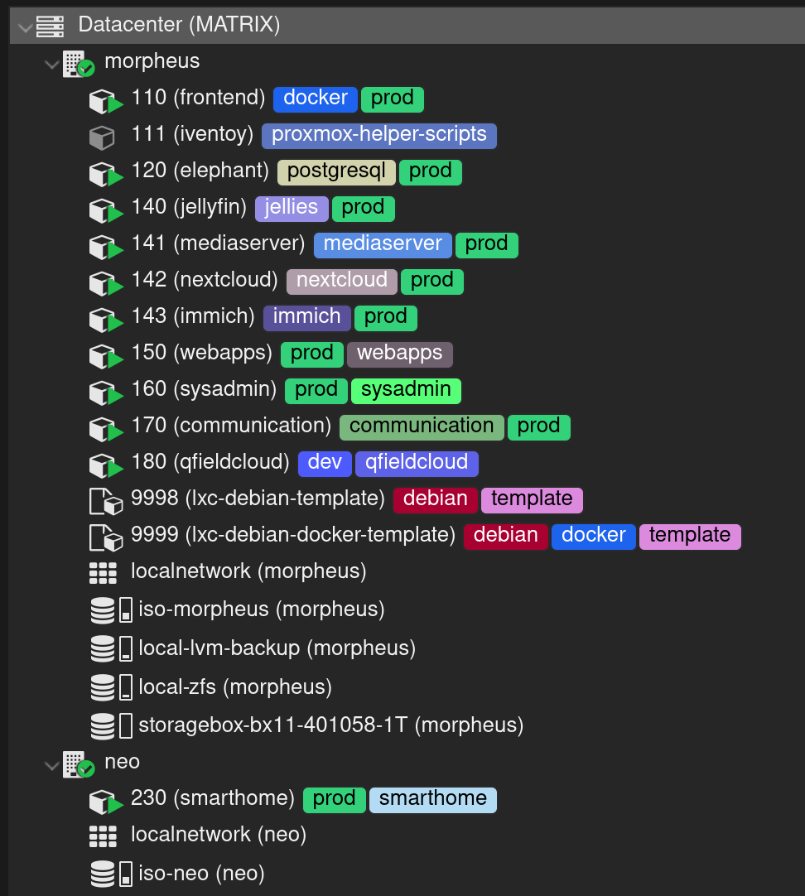

# **Virtual Machine (VM) et Linux Containers (LXC)**

L'auto-hébergement est devenue un passe-temps ! J'aime découvrir de nouveaux services que je pourrai éventuellement mettre en place sur mon NAS et pour le moment, tous mes services tournent sur des conteneurs LXC depuis Proxmox.

<figure markdown="span">
  { width="400" }
  <figcaption>Ensemble des machines déployées sur mon cluster Proxmox</figcaption>
</figure>

Voici à quoi ressemble mon architecture :

```mermaid
flowchart LR
    proxmox@{ img: "/assets/images/logo/proxmox.svg", label: "", pos: "t", w: 100, h: 50, constraint: "on" }
    style proxmox color:none,fill:none,stroke:none,stroke-width:0px

    subgraph **Cluster Proxmox**
      morpheus("**Morpheus**<br/>PVE")
      style morpheus color:#ffffff,fill:none,stroke:#333,stroke-width:2px
      neo("**Neo**<br/>PVE + PBS")
      neo-pve("**Neo**<br/>PVE:8006")
      neo-pbs("**Neo**<br/>PBS:8007")
      style neo color:#ffffff,fill:none,stroke:#333,stroke-width:2px
    end

    subgraph **Conteneurs LXC**
        frontend{"__Frontend__<br/>Mémoire : __1GO__<br/>Swap : __1GO__<br/>Cores : __2__<br/>Disque : __16GO__"}
        elephant{"__Elephant__<br/>Mémoire : __16GO__<br/>Swap : __1GO__<br/>Cores : __4__<br/>Disque : __128GO__"}
        jellyfin{"__Jellyfin__<br/>Mémoire : __8GO__<br/>Swap : __4GO__<br/>Cores : __4__<br/>Disque : __32GO__"}
        mediaserver{"__Mediaserver__<br/>Mémoire : __1GO__<br/>Swap : __1GO__<br/>Cores : __2__<br/>Disque : __16GO__"}
        nextcloud{"__Nextcloud__<br/>Mémoire : __4GO__<br/>Swap : __4GO__<br/>Cores : __2__<br/>Disque : __16GO__"}
        immich{"__Immich__<br/>Mémoire : __8GO__<br/>Swap : __4GO__<br/>Cores : __4__<br/>Disque : __16GO__"}
        webapps{"__Webapps__<br/>Mémoire : __1GO__<br/>Swap : __512MO__<br/>Cores : __2__<br/>Disque : __16GO__"}
        sysadmin{"__Sysadmin__<br/>Mémoire : __1GO__<br/>Swap : __512MO__<br/>Cores : __2__<br/>Disque : __16GO__"}
        communication{"__Communication__<br/>Mémoire : __512MO__<br/>Swap : __512MO__<br/>Cores : __2__<br/>Disque : __8GO__"}
    end

    subgraph **Conteneurs LXC**
        smarthome{"__Smarthome__<br/>Mémoire : __1GO__<br/>Swap : __1GO__<br/>Cores : __2__<br/>Disque : __16GO__"}
    end

    subgraph **Services**
        docker-frontend-stack[***Portainer***<br/>***Traefik***<br/>***Authelia***<br/>***Fail2ban***<br/>***Headscale***<br/>***Tailscale***]
        style docker-frontend-stack color:none,fill:none,stroke:none,stroke-width:0px

        elephant-stack[***PostgreSQL 16***<br/>***PostGIS 3.4.2***]
        style elephant-stack color:none,fill:none,stroke:none,stroke-width:0px

        docker-jellyfin-stack[***Jellyfin***<br/>***TinyMediaManager***]
        style docker-jellyfin-stack color:none,fill:none,stroke:none,stroke-width:0px

        docker-mediaserver-stack[***Navidrome***<br/>***Bonob***<br/>***Calibre Web***]
        style docker-mediaserver-stack color:none,fill:none,stroke:none,stroke-width:0px

        docker-nextcloud-stack[***Nextcloud***<br/>***Onlyoffice***]
        style docker-nextcloud-stack color:none,fill:none,stroke:none,stroke-width:0px

        docker-immich-stack[***Immich***]
        style docker-immich-stack color:none,fill:none,stroke:none,stroke-width:0px

        docker-webapps-stack[***Homepage***<br/>***Filebrowser***<br/>***Vaultwarden***<br/>***Jellystat***]
        style docker-webapps-stack color:none,fill:none,stroke:none,stroke-width:0px

        docker-sysadmin-stack[***Healthchecks***<br/>***Uptime-Kuma***<br/>***Dozzle***]
        style docker-sysadmin-stack color:none,fill:none,stroke:none,stroke-width:0px

        docker-communication-stack[***NTFY***]
        style docker-communication-stack color:none,fill:none,stroke:none,stroke-width:0px

        docker-smarthome-stack[***Home-Assistant***<br/>***Zigbee2mQTT***<br/>***Node-Red***<br/>***ESPHome***]
        style docker-smarthome-stack color:none,fill:none,stroke:none,stroke-width:0px
    end

    proxmox --> morpheus
    proxmox --> neo
    neo --> neo-pve
    neo --> neo-pbs
    morpheus --> frontend --> docker-frontend-stack
    morpheus --> elephant --> elephant-stack
    morpheus --> jellyfin --> docker-jellyfin-stack
    morpheus --> mediaserver --> docker-mediaserver-stack
    morpheus --> nextcloud --> docker-nextcloud-stack
    morpheus --> immich --> docker-immich-stack
    morpheus --> webapps --> docker-webapps-stack
    morpheus --> sysadmin --> docker-sysadmin-stack
    morpheus --> communication --> docker-communication-stack
    neo-pve --> smarthome --> docker-smarthome-stack

    click frontend href "/services/lxc/frontend"
    click docker-frontend-stack href "/services/docker/frontend-stack"
```