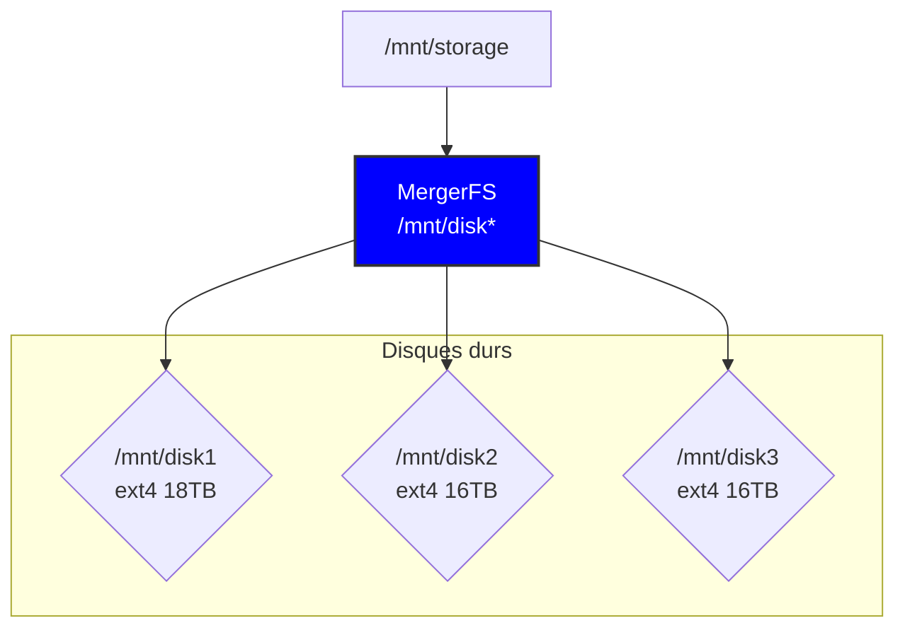

# :material-graph: **Méthodologie**

On va donc retrouver sous le capot :

## **Proxmox Virtual Environment**

**Installation en baremetal**, [Proxmox Virtual Environment](https://www.proxmox.com/en/proxmox-virtual-environment/overview) est une plate-forme complète de gestion de serveurs open source pour la virtualisation d'entreprise. Il intègre étroitement l'hyperviseur KVM et les conteneurs Linux (LXC), la fonctionnalité de stockage et de réseau définie par logiciel, sur une plate-forme unique. Avec une interface utilisateur basée sur le web, vous pouvez gérer les machines virtuelles et les conteneurs, la haute disponibilité pour les clusters ou les outils de reprise après sinistre intégrés avec facilité. **Par conséquent, il y a une énorme marge de manœuvre pour l'évolutivité du serveur.**

!!! success "Proxmox est le bon choix pour vous si :"

    1. Vous aimez une distribution Linux stable qui est Debian,
    2. Vous voulez faire fonctionner des machines virtuelles et des conteneurs LXC,
    3. Vous voulez utiliser la technologie ZFS,
    4. Vous souhaitez regrouper plusieurs serveurs,
    5. Vous souhaitez aller plus loin avec [Proxmox Backup Server](https://www.proxmox.com/en/proxmox-backup-server/overview).

## **Données et stockage** 

### :material-set-merge: [MergerFS](https://github.com/trapexit/mergerfs) 

[MergerFS](https://github.com/trapexit/mergerfs) est un système de fichiers d'union très puissant. Il sera utilisé dans ce projet pour **« fusionner »** les disques ensemble pour créer un point de montage unifié de stockage.

Voici un petit schéma de principe :

Souligons que [MergerFS](https://github.com/trapexit/mergerfs) utilise des politiques de stockage pour définir comment les données sont copiées/hiérarchisées sur les différents disques qui composent le pool unifié, et c'est le choix d'une de ces politiques qui va nous permettent de configurer notre NAS. À savoir qu'une [politique](https://github.com/trapexit/mergerfs?tab=readme-ov-file#policies) est l'algorithme utilisé pour choisir une ou plusieurs branches (comprendre disques) sur lesquelles une fonction doit travailler ou, de manière générale, comment la fonction se comporte.

Il en existe [une bonne liste](https://github.com/trapexit/mergerfs?tab=readme-ov-file#policies) mais je m'attarderais sur deux qui ont retenu mon attention, `lfs` et `epmfs` :

- `lfs` pour `Least Free Space` - ***choix de la branche avec le moins d’espace libre disponible*** : vise à équilibrer l'espace libre sur tous les disques. MergerFS écrit toujours de nouvelles données sur le disque avec l'espace le moins libre disponible.

!!! abstract "Note"

    Bien que cela utilise uniformément tous les disques, cela représente des inconvénients importants pour des cas d'utilisation spécifiques. Pour les collections de médias, où les fichiers connexes (comme les épisodes d'une émission de télévision) sont souvent consultés ensemble, la politique  `lfs` peut diffuser ces fichiers à travers plusieurs disques. Par exemple, si vous avez quatre saisons d'émission télévisée, les épisodes de chaque saison pourraient se retrouver sur un disque différent.

    Cette approche peut conduire à :

    - une récupération inefficace : l'accès à une saison complète pourrait nécessiter la filature de plusieurs disques, plus de consommation d'énergie, l'usure des disques,
    - un cauchemare dans l'organisation des fichiers : l'étalement des fichiers connexes est lourd pour travailler sur les données qui devraient être ensemble,
    - Si on perd un lecteur et de la parité, il est plus facile de récupérer une petite partie de données similaires, contre des milliers de fichiers aléatoires.

- `epmfs` pour `Existing Path, Most Free Space` - ***parmi toutes les branches sur lesquelles le chemin relatif existe, choisissez la branche avec le plus d'espace libre*** : il faut comprendre ***priorité au répertoire existant***, si un répertoire existe déjà sur l'un des disques, de nouveaux fichiers destinés à ce répertoire y seront placés. Cela garantit que les fichiers connexes, comme les épisodes de la même saison télévisée, restent ensemble sur le même disque tant qu'il y a de l'espace.

!!! abstract "Note"

    Si le répertoire n'existe sur aucun disque (par exemple, lors de l'ajout d'une nouvelle émission de télévision ou d'une nouvelle saison), l'annuaire sera créé sur le disque avec l'espace le plus important. Cela aide à équilibrer l'utilisation globale du stockage à travers les disques.

La politique `epmfs` combine le meilleur des deux options. Il maintient les fichiers connexes ensemble pour plus de clarté, tout en veillant à ce que l'espace disque soit utilisé efficacement, et c'est donc ce que je vais utiliser sur mon pool de données MergerFS.