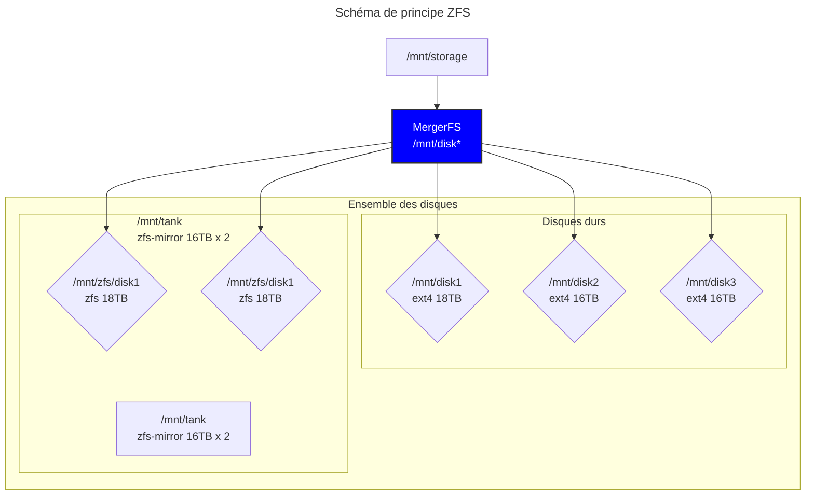

```mermaid
---
title : Schéma de principe ZFS
---
flowchart TD
    storage["/mnt/storage"]
    mergerfs-disks["MergerFS<br/>/mnt/disk*"]
    style mergerfs-disks color:#ffffff,fill:#0000ff,stroke:#333,stroke-width:2px

    subgraph Ensemble des disques
        subgraph Disques durs
            disk1{"/mnt/disk1<br/>ext4 18TB"}
            disk2{"/mnt/disk2<br/>ext4 16TB"}
            disk3{"/mnt/disk3<br/>ext4 16TB"}
        end

        subgraph "/mnt/tank<br/>zfs-mirror 16TB x 2"
            zfsDisk1{"/mnt/zfs/disk1<br>zfs 18TB"}
            zfsDisk2{"/mnt/zfs/disk1<br>zfs 18TB"}

            zfs-mirror["/mnt/tank<br/>zfs-mirror 16TB x 2"]
            style mergerfs-disks color:#ffffff,fill:#0000ff,stroke:#333,stroke-width:2px
        end
    end    

    storage --> mergerfs-disks
    mergerfs-disks --> disk1
    mergerfs-disks --> disk2
    mergerfs-disks --> disk3
    mergerfs-disks --> zfsDisk1 ~~~ zfs-mirror
    mergerfs-disks --> zfsDisk2 ~~~ zfs-mirror
```